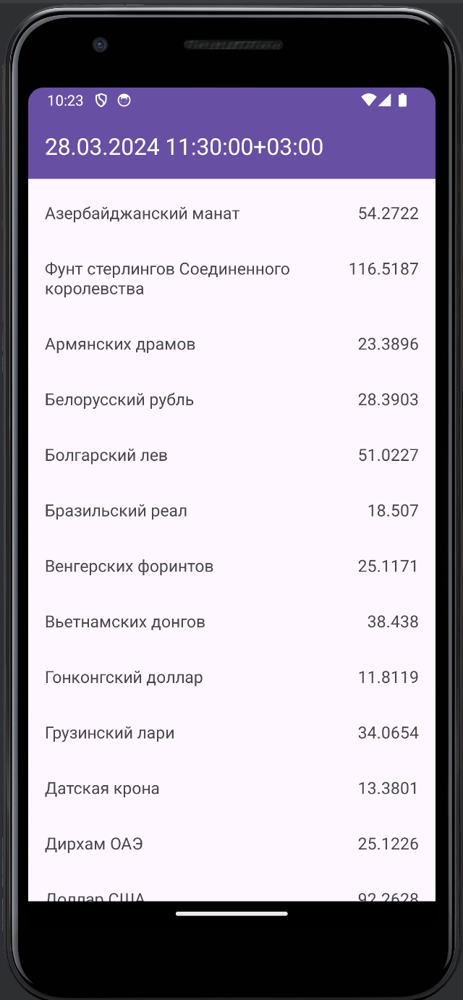

# Приложение по показу актуального курсу валют ЦБ

## Требования:
 - Экран с отображением списка валют с отображением названия и текущего курса валюты по отношению к рублю
 - Использовать API https://www.cbr-xml-daily.ru/daily_json.js
 - Сверху должно быть отображена дата и время последней корректной загрузки данных
 - олжно быть реализовано отображение загрузки в виде ProgressBar, сетевые ошибки должны быть обработаны.
 - Функционал автообновления данных списка каждые 30 секунд
 - Должна быть корректная обработка ситуаций, когда приложение свернуто
- Использовать: Kotlin, XML, Android SDK min api 24, Retrofit2, gson

## Скриншот готового приложения:

